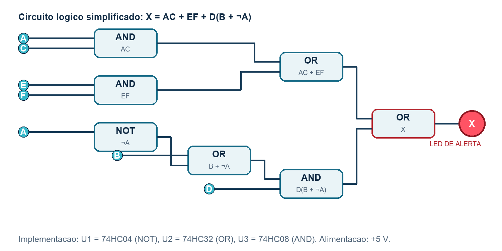

# Mission Control AI

Sistema de alerta por lógica digital desenvolvido para uma missão espacial experimental.

O projeto monitora seis condições operacionais e aciona o alerta principal `X` quando identifica uma combinação crítica. Ele reúne lógica booleana, tabela verdade, circuito com CIs e uma simulação interativa.

## Demonstração

Abra [`simulacao_mission_control.html`](simulacao_mission_control.html) no navegador para:

- alternar as seis entradas digitais;
- acompanhar os sinais intermediários;
- observar o LED virtual de alerta;
- consultar as 64 combinações da tabela verdade.

## Lógica implementada

Expressão completa:

```text
X = AC + BD + EF + D·NOT(A) + ACD
```

Expressão simplificada:

```text
X = AC + EF + D(B + NOT(A))
```

O sistema utiliza obrigatoriamente as operações lógicas `AND`, `OR` e `NOT`.

## Circuito



Componentes principais:

- `74HC04`: portas NOT;
- `74HC08`: portas AND;
- `74HC32`: portas OR;
- LED vermelho e resistor de `330 Ω`;
- chaves de entrada, resistores pull-down, protoboard e fonte de `5 V`.

## Arquivos

| Arquivo | Descrição |
| --- | --- |
| `Relatorio_Mission_Control_AI.docx` | Relatório técnico completo e pronto para entrega |
| `simulacao_mission_control.html` | Simulação interativa executada diretamente no navegador |
| `circuito_logico.png` | Diagrama da expressão lógica simplificada |
| `gerar_relatorio.py` | Gerador reproduzível do relatório e do diagrama |

## Informações acadêmicas

- **Curso:** Ciência da Computação
- **Turma:** 1CCPF
- **Professor:** Mauricio Neto
- **Data:** 08/06/2026
